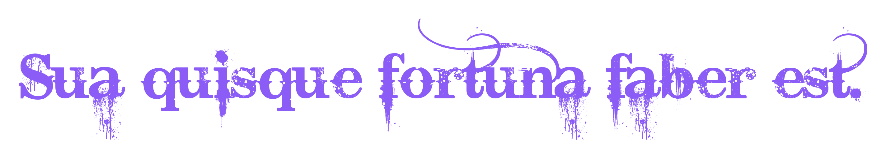

<div align="center">



<p align="center"><sub><i>Sua quisque fortuna faber est. — Each is the architect of his own fortune.</i></sub></p>

<br/>


<br/>


&nbsp;

&nbsp;


<br/><br/>

<a href="https://www.linkedin.com/in/bennett-payoyo-a942a0379">
  
</a>
&nbsp;
<a href="mailto:bennettpayoyo025@gmail.com">
  
</a>
&nbsp;
<a href="https://github.com/Yahiro025">
  
</a>
&nbsp;


<br/>


</div>

---

<h2 align="center"><code>01 // IDENTITY</code></h2>

I'm **Bennett Payoyo** — a sophomore in **B.S. Computer Science** at the **Polytechnic University of the Philippines**, Manila. I build focused, applied tools for Philippine-context problems: AI / RAG apps, social-good prototypes, and small-business tooling. I learn by shipping.

> [!IMPORTANT]
> **Open to:** open-source collaboration and hackathon teams.

---

<h2 align="center"><code>02 // TECH ARSENAL</code></h2>

<p align="center">
  
</p>

<p align="center">
  
</p>

<p align="center">
  
</p>

---

<h2 align="center"><code>03 // AI SYSTEMS</code></h2>

| Domain | Signal | What I build |
| :--- | :--- | :--- |
| **LLM / RAG application engineering** | Core focus | End-to-end LLM apps with LangChain.js, RAG over vector stores, and streaming chat UX. |
| **AI for social-good prototyping** | Active focus | Hackathon-grade vision, OCR, and classification pipelines for Philippine-context problems. |

---

<h2 align="center"><code>04 // FEATURED BUILDS</code></h2>

<details open>
<summary><b>🧠 BANTAYOG — Blockchain-backed subsidy system vs. childhood stunting</b></summary>
<br/>

On-chain subsidy system tackling childhood stunting in the Philippines. Image validation gates purchases so funds are only redeemable against nutritious food. A social-good prototype that closes the loop between subsidy disbursement and nutritional correctness — on-chain redemptions gated by on-device image validation.

| Aspect | Detail |
| :--- | :--- |
| **My Role** | Backend + Researcher |
| **Stack** | Polygon Amoy testnet · Gemini 3.5 Flash (image validation) · Next.js |
| **Team** | 4-person team |
| **Award** | **1st Runner-Up — GDG SparkFest Hackathon**, July 9 |

<br/>

<a href="https://github.com/alxxrzfyr/BANTAYOG">
  
</a>
&nbsp;
<a href="https://drive.google.com/file/d/1HbexEd2dmRrOxbiT5l1bJY4QRoW5PWiQ/view">
  
</a>

</details>

<details>
<summary><b>🎓 TANGLAW — Scholarship-matching RAG tool for Filipino students</b></summary>
<br/>

Matches Filipino students to scholarships via a LangChain + RAG pipeline over scholarship documents — semantic match, not keyword search. A class-required build that puts the right scholarship one search away for students who can't afford to miss the fit.

| Aspect | Detail |
| :--- | :--- |
| **Stack** | Express.js · LangChain · RAG |
| **Context** | Class project · small team |

<br/>

<a href="https://tanglaw-project.vercel.app">
  
</a>
&nbsp;


</details>

<details>
<summary><b>📖 Bicol Dictionary — Regional-language preservation app</b></summary>
<br/>

Keeps the Bicol language searchable and accessible — entry lookup and search, backed by Supabase. A focused tool for keeping a Philippine regional language discoverable for the next generation of speakers.

| Aspect | Detail |
| :--- | :--- |
| **Stack** | Supabase (Database) |

<br/>

<a href="https://bicol-app.vercel.app">
  
</a>
&nbsp;


</details>

<details>
<summary><b>📒 Clarity Books — Quarterly bookkeeping assistant for PH small businesses</b></summary>
<br/>

Snap a receipt photo — it classifies the line as Sale or Expense, extracts merchant, date, amount, VAT, and exports a draft quarterly tax estimate. A pragmatic sari-sari-store and small-MSME bookkeeping tool that turns a phone photo into a reviewable ledger line.

| Aspect | Detail |
| :--- | :--- |
| **Stack** | Next.js · Tailwind · Supabase · classification via LLM call |

<br/>

<a href="https://clarity-books-mu.vercel.app">
  
</a>

</details>

---

<h2 align="center"><code>05 // SIGNAL LOG</code></h2>

> [!NOTE]
> 🏅 **1st Runner-Up — GDG SparkFest Hackathon** · **BANTAYOG** · 4-person team · July 9.

```yaml
status: sophomore @ PUP Manila
learning:
  - shipping real things
  - applied AI for Philippine contexts
building:
  - Clarity Books
  - TANGLAW
  - BANTAYOG
  - Bicol Dictionary
exploring:
  - AI policy and ethics
  - mobile-first UX
  - Philippine tech community and OSS
```

---

<h2 align="center"><code>06 // GITHUB TELEMETRY</code></h2>

<p align="center">
  
  
</p>

<p align="center">
  
</p>

---

<div align="center">


</div>
